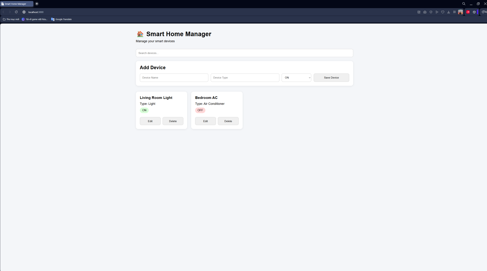

# Smart Home Device Manager

A simple Smart Home Device Management web application built with Express and Vanilla JavaScript.

## Preview



A simple Smart Home Device Management web application...

## Features

* View device list
* Search devices
* Add new device
* Edit device
* Delete device
* Express REST API integration

## Tech Stack

Backend:

* NodeJS
* Express

Frontend:

* HTML
* CSS
* Vanilla JavaScript

## Project Structure

backend/

* controllers
* routes
* data

frontend/

* js
* style.css
* index.html

## Installation

Clone repository:

```bash
git clone YOUR_REPO_URL
```

Install backend:

```bash
cd backend

npm install
```

Run:

```bash
cd backend
npm start
```

Open:

```text
http://localhost:3000
```


